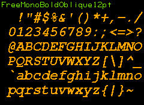
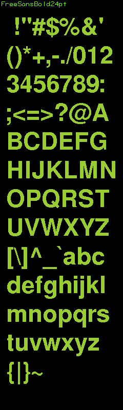
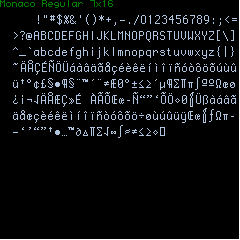
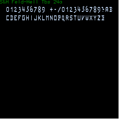

# Meadow Font Test
Add new fonts to Meadow MicroGraphics Library

Here we demonstrate adding new fonts to the Meadow MicroGraphics Library

1. Consolas 
2. IBM Plex Mono
3. Sometype Mono
4. BP Typewrite
5. IBM 3270
6. 52 Adafruit GFX fonts
7. Microsoft .NetMF fixed fonts
8. Petscii - character ROM dump
9. Release the Hoard! - 37 Fixed width Yaff fonts from the [Bitmap Hoard](https://github.com/robhagemans/hoard-of-bitfonts) 

The <a href="https://github.com/WildernessLabs/Meadow.Foundation/tree/main/Source/Meadow.Foundation.Libraries_and_Frameworks/Graphics.MicroGraphics">Meadow.Foundation MicroGraphics Library</a>
supports drawing fonts in a few (now 8) fixed width sizes.  

4x6| 4x8| 6x8| 8x8| 8x12| 8x16| 12x16| 12x20|
:-:|:-: |:-: |:-: |:-: |:-: |:-: |:-:  |
|||||||

The smaller sizes may be appropriate for hand drawn fonts, but if we are converting higher quality desktop fonts, 12x20 is the only size that can support fonts with descenders.
These initial attempts target fixed width or Monospaced fonts.

## Consolas
<a href="https://docs.microsoft.com/en-us/typography/font-list/consolas">Consolas</a> is a Microsoft font, used in visual studio, it may not be appropriate for open source use. 

<a href="http://wiki.squeak.org/squeak/1849">Although apparently Fonts are not Copyright protected</a>

So I found 3 open source fonts, which ended up with a much smaller character set


## IBM Plex Mono
<a href="https://www.1001fonts.com/ibm-plex-mono-font.html">IBM Plex Mono</a> or on <a href="https://github.com/IBM/plex">Github</a>


## Sometype Mono
<a href="https://monospacedfont.com/">monospacedfont</a> or on <a href="https://github.com/dharmatype/Sometype-Mono">Github</a>


## BP Typewrite
<a href="https://www.1001fonts.com/bptypewrite-font.html">BP Typewrite</a> may be the most distinct of these fonts. It is based on an italic font stood upwrite.
Smaller set of characters.


## IBM 3270

A favourite for terminal fonts or code editing. This version comes from an OpenType font converted back to bitmap 12x20.
It has many of the drawing symbols of the petscii font - at a larger size, and at less precision. This font has many unicode characters hence the double size screenshot.


from <a href="https://github.com/rbanffy/3270font">github</a>

To use them in your meadow project, you just need to compile the font file into your application.
Then 
```
graphics.CurrentFont = new BPtypewrite12x20();
```

The Windows application to generate these font files is called <a href="https://github.com/MarkAlanJones/FontConverter">FontConverter</a>

# GFX Fonts

from <a href="https://github.com/adafruit/Adafruit-GFX-Library">Adafruit</a>. These are bitmap fonts, that are proportionatley spaced, and support text wrapping.
I had to convert the C++ .h files into C#. There seems to be 3 font faces converted from Berkley Unix.

1. **Free Mono**
2. **Free Sans**
3. **Free Serif**

Each font has four typefaces: **Normal**, **Bold**, **Oblique** (or *Italic*), and **Bold Oblique** (or *Bold Italic*) 
and appears in four sizes: 9pt, 12pt, 18pt, 24pt.

## Free Mono

| Normal     |      Bold     |  Oblique  | Bold Oblique   |
|:----------:|:-------------:|:---------:|:--------------:|
|   |    |  |  |
| |  |||
| |  | | |
| |  |||

## Free Sans

| Normal     |      Bold     |  Oblique  | Bold Oblique   |
|:----------:|:-------------:|:---------:|:--------------:|
|   |    |  |  |
| |  |||
| |  | | |
| |  |||

## Free Serif

| Normal     |      Bold     |  Italic   | Bold Italic    | 
|:----------:|:-------------:|:---------:|:--------------:|
|   |    |  |  |
| |  |||
| |  | | |
| |  |||

There are also 4 additional extra small fonts, in one typeface each. Other than the TomThumb font, only the lower 7bit ascii characters are available.
I have included a 4 times zoom of each of the small fonts so you can see the detail (or lack thereof).

## Org_01


## Picopixel


## Tiny3x3


## Tom Thumb


To use GFX fonts in your Meadow project, you need to include the **GFXFontBase.cs** and the **GraphicsLibraryEx.cs** as well as any of the GFX fonts you want to use.
**DrawGFXText** is used to display text. The x,y origin is for the left baseline of the character (not the upper left). The **WrapText** property can be enabled and text will be written on the next line if it doesn't fit on the current line. 
 

More GFX font info: <a href="https://learn.adafruit.com/adafruit-gfx-graphics-library/using-fonts">Here</a> and 
<a href="https://glenviewsoftware.com/projects/products/adafonteditor/adafruit-gfx-font-format/">Here</a>

There are certainly other GFX fonts avaialble, including tools to convert to the GFX format. Adafruit says they will not expand the base fonts available on Github any further.

# Microsoft .NetMF fixed fonts

I found these in the abandoned <a href="https://github.com/NETMF/netmf-interpreter/tree/dev/DeviceCode/Drivers/Display/TextFonts">.net Micro Framework</a> repository. They include a few extended characters. The way the character bitmaps are laid out is much easier to hand edit if you want to.

Converted from C++ these are compatible with the Meadow Graphics Library Fonts (just include the font file).

## 8x8 


## 8x15 


# Petscii 8x8

The OG personal computer circa 1977 was the Commodore PET - 6502 processor, cassette deck, green text enclosed in an industrial steel case.
This version of the ROM is from the SuperPet a weird work from home offshoot that had Pascal, Fortran and APL built in along with the MSBasic.
So along with the famous line drawing characters, we also get some APL symbols and several other rare math symbols.
The character set is mapped to unicode (rather than the original shiftable 7bit ascii). See the comments for which unicode character to use.

from <a href="http://www.6502.org/users/sjgray/computer/cbmchr/cbmchr.html">6502.org</a>

## Petscii8x8


and don't forget, the Meadow Graphics Library can also display fonts at 2X or 3X
here is petscii at 2X (16x16)


# The Bitmap Hoard 
## Part 1 - Fixed width 12px or less

[Rob Hagemans](https://github.com/robhagemans/hoard-of-bitfonts) has not only collected many historical bitmap fonts, he has also created a new storage format ([Yaff](https://github.com/robhagemans/monobit/blob/master/YAFF.md)) that is more human readable than most formats, and not too bad to parse.

These Fonts, are read by the YaffReader, which returns an IYaffFont which is an IFont that the Micrographics DrawText function can use.
This means you can include the YaYaffReader.cs in your meadow application, along with any number of these Yaff files, and load and display the font at runtime.
This consumes more memory than compiling the fonts, but being able to treat the fonts as files, instead of code is more convienient.

### Amiga

| Topaz | | | |
|:----------:|:-------------:|:---------:|:--------------:|
|  |  |   |  |
| Xen | | | |
|  |   |   | |
| Nudel | | | |
|  |  |  |   |
| MagicWB XCourier | | | |
|  |  |   | |
| Courier |
|  |  |  |   |

### Apple [Mac](https://github.com/robhagemans/hoard-of-bitfonts/tree/master/apple-mac)

Gacha and Monaco are two of the few fixed Mac Fonts. There are a few slightly smaller versions of both.

| Gacha 7x13 |  Monaco 7x16 |
|:----------:|:-------------:|
| |  |

### Atari 

| Classic | ST 6x6 | ST 8x8 | ST 8x16 |
|:----------:|:-------------:|:---------:|:--------------:|
| | | | |


### [Gem](https://github.com/robhagemans/hoard-of-bitfonts/tree/master/gem)

There are several other sizes for these fonts in the hoard

| DrDos 8x19 | Gem 3.1 6x6 | Viewmax 8x8|
|:----------:|:-------------:|:---------:|
|  |  | |

### [Hellschreiber](https://github.com/robhagemans/hoard-of-bitfonts/tree/master/hellschreiber)

| Feld-Hell Typenbildschreiber 7x14  | Hellschreiber T-Typ 72 GL 7x14  | Hell-80  7x9 | GTL Telewriter 7x8   | 
|:----------:|:-------------:|:---------:|:--------------:|
| | | | |
| Abtastfernschreiber  8x14     ||||
|   ||||

### DEC VT-xxx Terminals

| VT-52 | VT-100 | VT-220 |
|:----------:|:-------------:|:---------:|
| |  |   |
| funky g and lightning tilda | Desenders and line drawing characters  | Accented characters, backward ?  | 

### [Olivetti](https://github.com/robhagemans/hoard-of-bitfonts/tree/master/kyotronic)

There are other regional versions with slightly different characters as well


